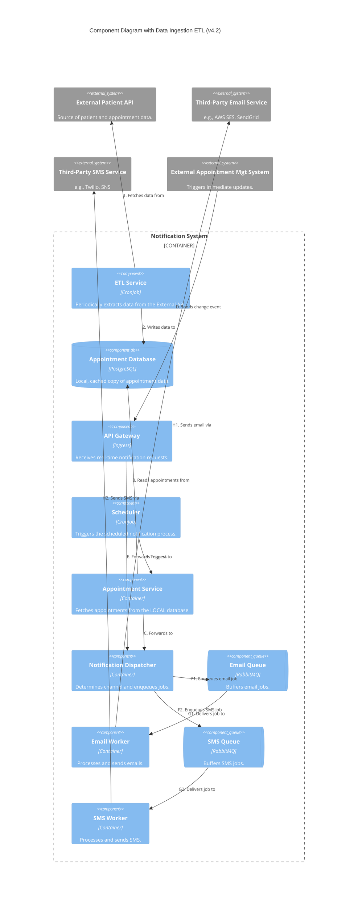
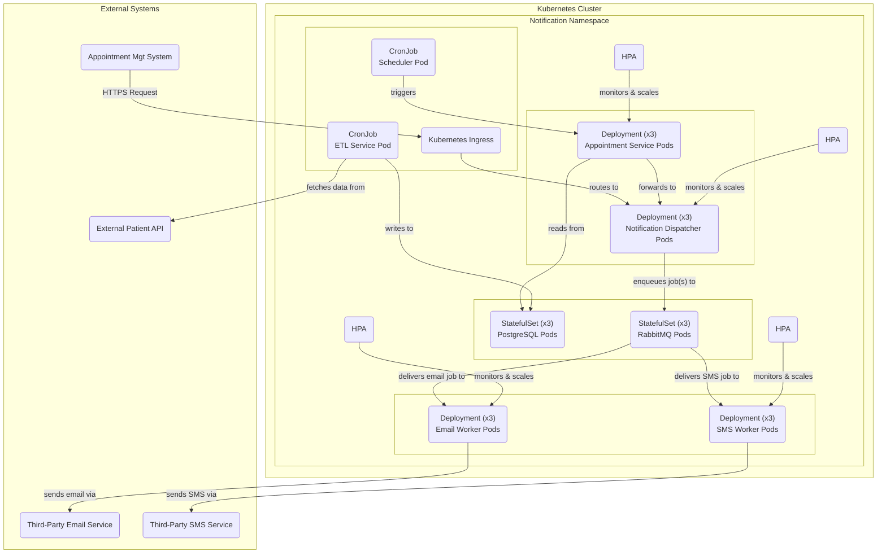

# Patient Notification System

A scalable, cloud-native patient notification system designed to send scheduled reminders and immediate appointment updates via SMS and Email.

## Project Overview

### Requirements

- Send patients reminders about their upcoming appointments (3 days before, from 9am to 12pm)
    - SMS, Email or both
- Update patients about changes (time/venue) to their appointments (~100 a day)
    - Must be done immediately

### Performance Targets

- On average 8,000 appointments in a day
- 99% delivery rate
- Alerts on any failure

### Limitations

- Patient appointment and contact details are obtained via API
    - External System
    - 90% success rate

## Final Architecture Overview

The final design is a decoupled, event-driven system built on a microservices architecture. It is designed to be highly available, scalable, and portable across any standard Kubernetes environment.

**Key Components:**
- **Data Ingestion:** A `CronJob`-based **ETL Service** periodically fetches data from an external API into a local PostgreSQL database, decoupling the system from external dependencies.
- **Trigger Mechanisms:**
    - A **Scheduler** (`CronJob`) triggers scheduled batch reminders.
    - An **API Gateway** (`Ingress`) provides an entry point for immediate, event-driven notifications.
- **Core Pipeline:** A central **Notification Dispatcher** routes notification jobs to the correct **Message Queue** (RabbitMQ).
- **Delivery Workers:** Dedicated, auto-scaling **Email** and **SMS Workers** consume jobs from the queues and communicate with third-party delivery services.

## Technology Stack

- **Orchestration:** Kubernetes
- **Messaging:** RabbitMQ
- **Database:** PostgreSQL
- **Architecture Style:** Microservices, Event-Driven
- **Design Language:** Mermaid (for Architecture-as-Code)

## Logical View (C4 Component Diagram)

## Physical View (Deployment Diagram)

