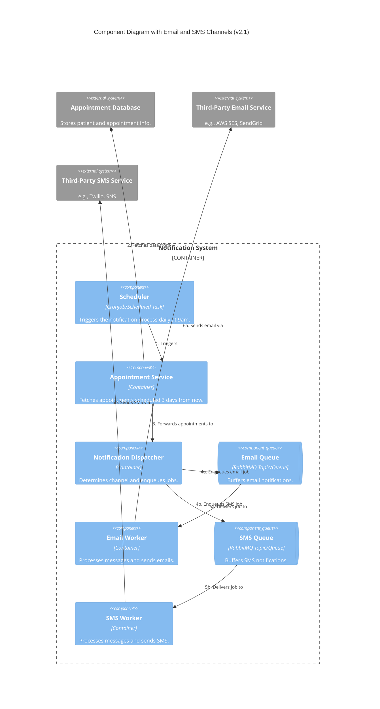
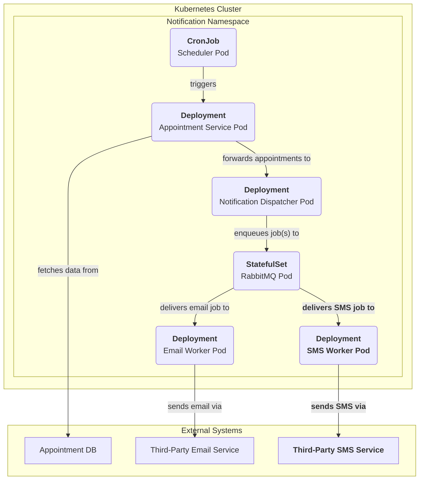

#### 1. Logical View (C4 Component Diagram)

This diagram now shows two parallel paths for notification delivery after the dispatcher.

#### 2. Physical View (AWS Deployment Diagram)

This view adds the new SMS worker deployment and the external SMS service.

#### 3. Component-to-Resource Mapping Table (New or Modified Components)

| Logical Component | Physical Resource | Rationale |
| :--- | :--- | :--- |
| **SMS Worker** | Kubernetes `Deployment` with a `Container` | This is a new, stateless worker. A `Deployment` is the standard for managing its lifecycle and allows for easy scaling, identical to the `Email Worker`. |
| **Notification Dispatcher**| (Modified) Kubernetes `Deployment` | The physical resource remains a `Deployment`. The container image will be updated with the new logic to handle channel selection and routing. No infrastructure change is needed. |
| **Message Queue** | (Modified) `StatefulSet` running RabbitMQ | The physical resource is unchanged. A new queue/exchange will be configured within the existing RabbitMQ service to handle SMS messages, demonstrating a software configuration change. |
