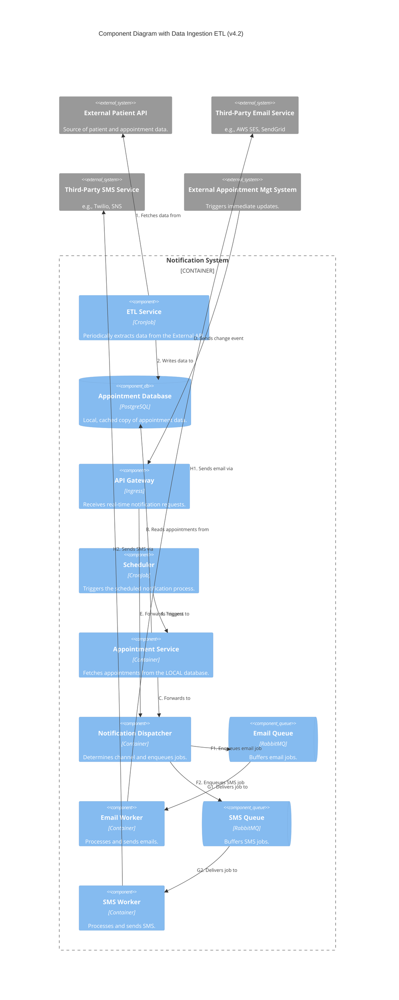
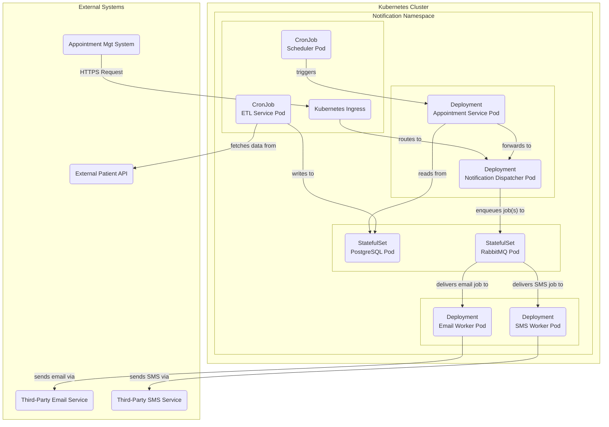

#### 1. Logical View (C4 Component Diagram)

This view introduces the new ETL service and clarifies that the Appointment DB is now an internal component.

#### 2. Physical View (Deployment Diagram)

This view adds a new CronJob for the ETL service and a StatefulSet for the new internal database.

#### 3. Component-to-Resource Mapping Table (New or Modified Components)

| Logical Component | Physical Resource | Rationale |
| :--- | :--- | :--- |
| **ETL Service** | Kubernetes `CronJob` | This is a periodic, batch-oriented task, making `CronJob` the perfect Kubernetes-native resource for scheduling its execution. |
| **Appointment Database**| Kubernetes `StatefulSet` with `PersistentVolumeClaim` | This is a stateful component that must persist data. A `StatefulSet` is the standard for running databases on Kubernetes, providing stable network IDs and storage. A `PersistentVolumeClaim` ensures the data survives pod restarts. |
| **Appointment Service**| (Modified) Kubernetes `Deployment` | The physical resource is unchanged. The container's code and configuration will be updated to point to the new internal database service address instead of an external one. |
