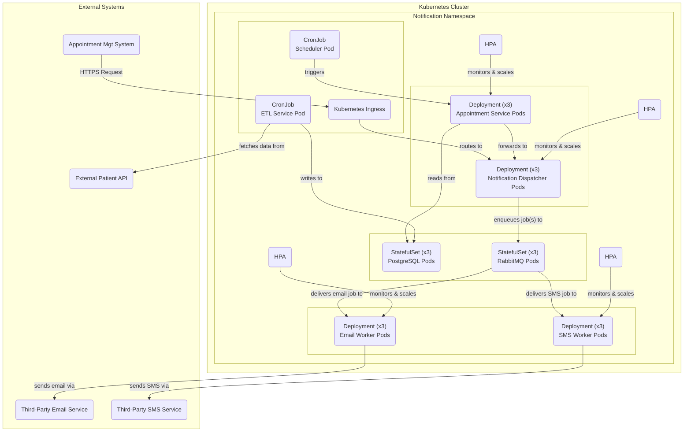

#### 1. Logical View (C4 Component Diagram)

**No change.**

The logical architecture remains the same. High availability and scalability are non-functional requirements that are implemented in the *physical view*. The components and their logical interactions do not change when we add more instances of them.

#### 2. Physical View (Deployment Diagram)

This is the only diagram that changes. It is updated to show multiple replicas and the addition of HPAs.

#### 3. Component-to-Resource Mapping Table (Updated Rationale)

| Logical Component | Physical Resource | Rationale (Updated for HA/Scalability) |
| :--- | :--- | :--- |
| Appointment Service | Kubernetes `Deployment` | Will be deployed with **3 replicas** for high availability. A **Horizontal Pod Autoscaler (HPA)** will be attached to automatically scale pods based on CPU/memory load. |
| Notification Dispatcher| Kubernetes `Deployment` | Will be deployed with **3 replicas** for high availability. A **Horizontal Pod Autoscaler (HPA)** will be attached to automatically scale pods based on CPU/memory load. |
| Email Worker | Kubernetes `Deployment` | Will be deployed with **3 replicas** for high availability. A **Horizontal Pod Autoscaler (HPA)** will be attached to automatically scale pods based on queue length or CPU. |
| SMS Worker | Kubernetes `Deployment` | Will be deployed with **3 replicas** for high availability. A **Horizontal Pod Autoscaler (HPA)** will be attached to automatically scale pods based on queue length or CPU. |
| Message Queue | `StatefulSet` running RabbitMQ | Will be deployed as a **3-node cluster** using a RabbitMQ operator or Helm chart to ensure high availability of the message bus. |
| Appointment Database | `StatefulSet` running PostgreSQL | Will be deployed as a **3-node cluster** with a primary and standbys using a PostgreSQL operator or Helm chart to ensure high availability of the data store. |
