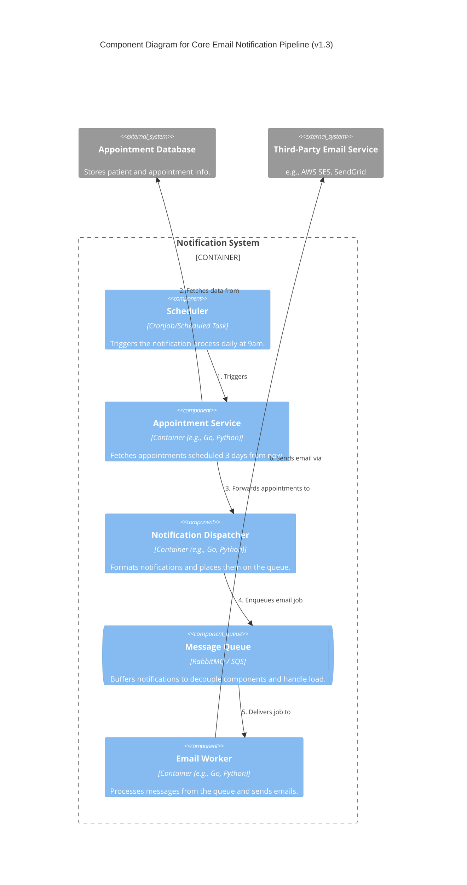
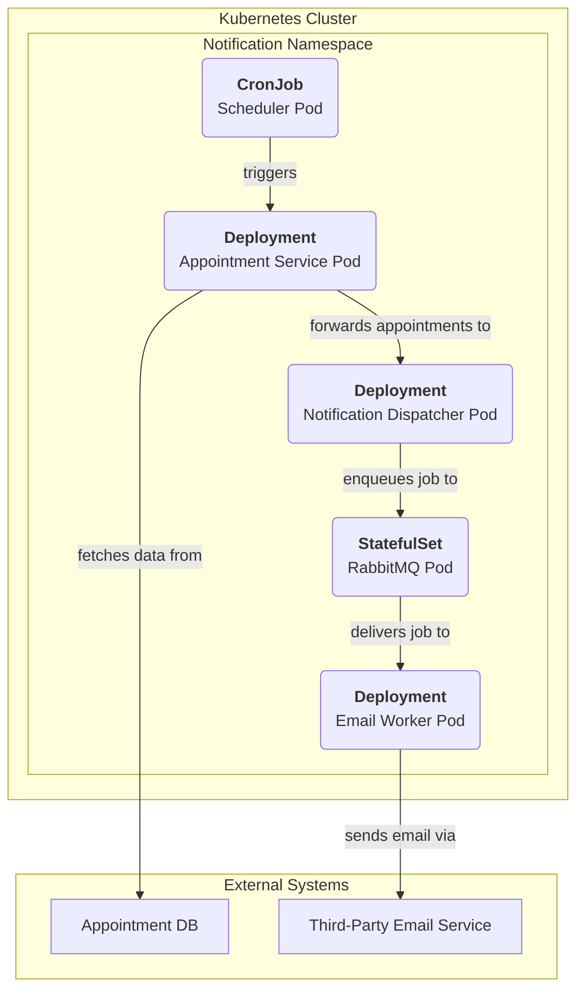

#### 1. Logical View (C4 Component Diagram)

#### 2. Physical View (AWS Deployment Diagram)

*For this design, we will use a generic container orchestration model based on Kubernetes primitives, which are portable to AWS (EKS), GCP (GKE), Azure (AKS), etc.*

#### 3. Component-to-Resource Mapping Table

| Logical Component | Physical Resource | Rationale |
| :--- | :--- | :--- |
| **Scheduler** | Kubernetes `CronJob` | Native Kubernetes resource for time-based job scheduling. Perfectly fits the "run at 9 am" requirement. Portable and standard. |
| **Appointment Service** | Kubernetes `Deployment` with a `Container` | A standard stateless service. A `Deployment` ensures it's running and can be scaled if needed later. |
| **Notification Dispatcher**| Kubernetes `Deployment` with a `Container` | Another core stateless service. A `Deployment` is the appropriate controller for managing its lifecycle. |
| **Message Queue** | `StatefulSet` running RabbitMQ (or a managed service) | RabbitMQ is a lightweight, widely-used message broker perfect for containerized environments. A `StatefulSet` is used for stateful applications like a message broker to ensure stable network identifiers and storage. |
| **Email Worker** | Kubernetes `Deployment` with a `Container` | A scalable, stateless consumer of jobs from the queue. A `Deployment` allows us to easily scale the number of worker pods to handle load. |
| **Appointment Database** | External Database (e.g., Amazon RDS, local PostgreSQL) | Separating the database from the cluster is a best practice for data persistence, management, and security. For this issue, we assume it exists. |
