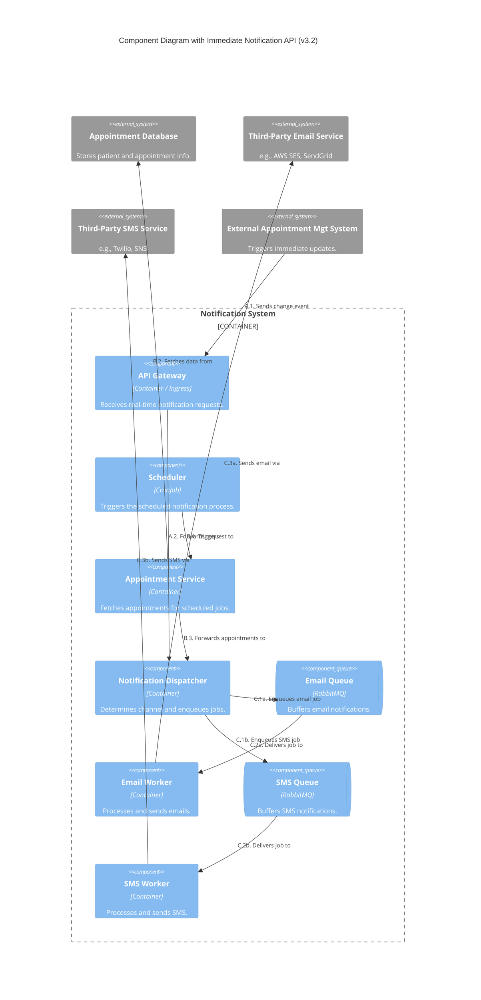
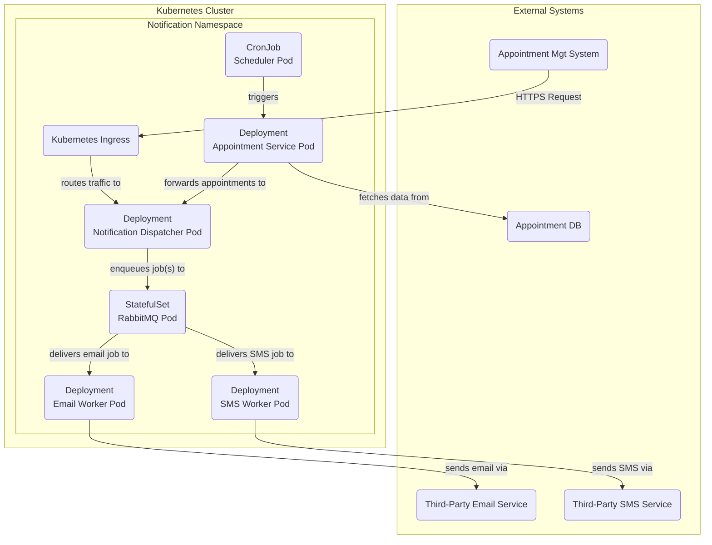

#### 1. Logical View (C4 Component Diagram)

This diagram introduces the new API Gateway and the external system that triggers it.

#### 2. Physical View (Deployment Diagram)

This view adds the Kubernetes Ingress, which acts as our API Gateway.

#### 3. Component-to-Resource Mapping Table (New or Modified Components)

| Logical Component | Physical Resource | Rationale |
| :--- | :--- | :--- |
| **API Gateway** | Kubernetes `Ingress` & `Service` | `Ingress` is the standard, cloud-agnostic Kubernetes resource for managing external access to services, typically HTTP. It handles routing, SSL/TLS termination, and can be backed by various controllers (Nginx, Traefik, cloud provider LBs). A `Service` provides the stable internal endpoint that the `Ingress` directs traffic to (`Notification Dispatcher` service). |
